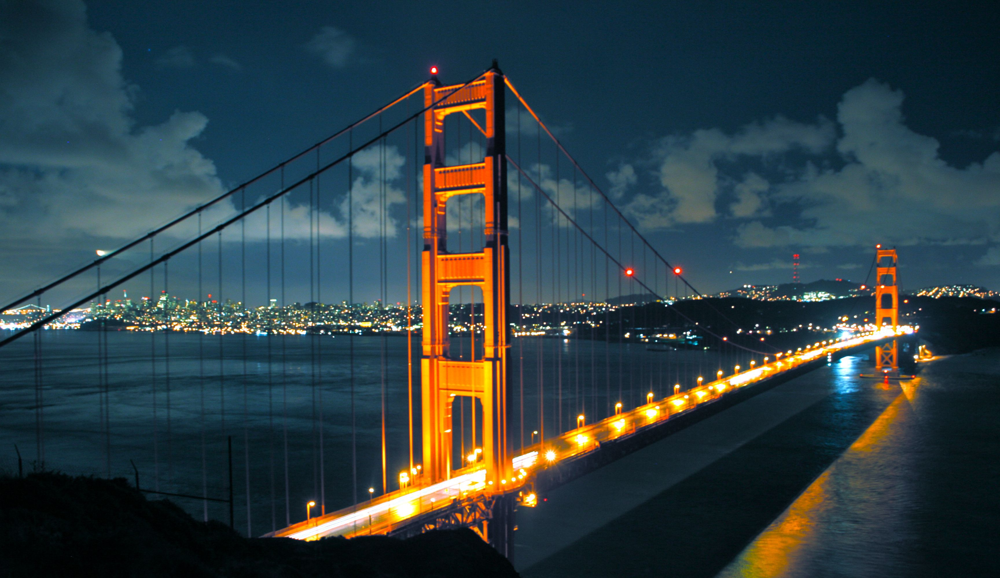

# Neural-Style-Transfer
Using Deep Learning and CNNs for Artistic Imaging.
Based on [Gatys et al.](https://arxiv.org/pdf/1508.06576.pdf) research paper and [Harish Narayanan](https://harishnarayanan.org/writing/artistic-style-transfer/) tutorial on Neural Style Transfer 
## Usage:
To use type `python NeuralStyle.py <path-to-content-image> <path-to-style-image>`

For More Parameters Read `NeuralStyle.py`
## Screenshots

